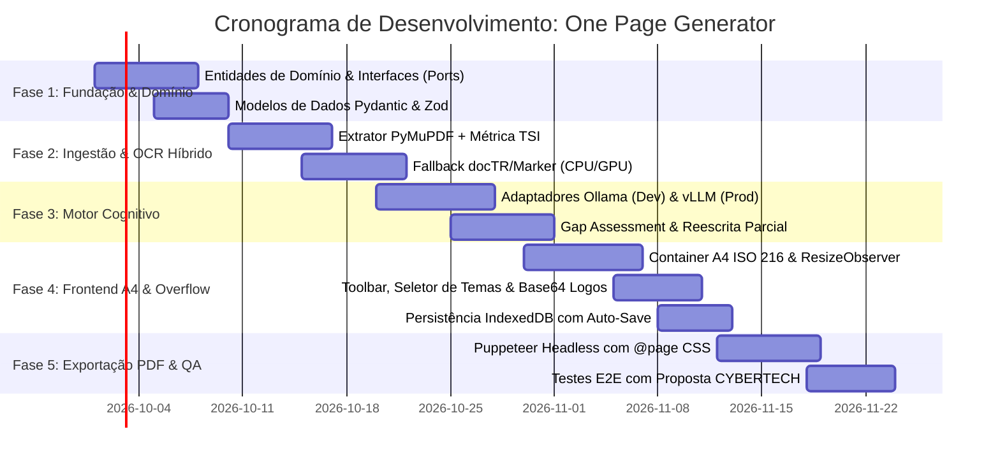

# Masterplan Arquitetural e Tecnológico (Clean Architecture): Co-Pilot One Page Report

> **Status do Documento**: Aprovado para Engenharia  
> **Versão**: 2.0.0  
> **Padrão Arquitetural**: Clean Architecture (Robert C. Martin) + Ports & Adapters (Hexagonal)  
> **Princípios Norteadores**: Clean Code, SOLID, Anti-Over-Engineering, Local-First / On-Premise AI  
> **Referência Primária**: [`docs/research.md`](file:///c:/workspace/one_page_generator/docs/research.md)

---

## 1. Visão Executiva e Avaliação Crítica da Proposta

### 1.1. Contexto e Proposta de Valor
A captação de recursos de inovação e fomento à PD&I industrial (editais FINEP, FAPESP, Embrapii, Rota 2030) junto ao ecossistema SENAI, SESI, FIESC e indústrias parceiras exige a síntese de planos de trabalho de 30 a 100 páginas em um documento executivo de altíssima densidade informacional e apelo visual: o **One Page Report (A4)**.

O sistema **One Page Generator (Co-Pilot)** automatiza a ingestão de propostas heterogêneas, extrai entidades com inteligência artificial, valida lacunas de submissão (Gap Assessment), renderiza uma página A4 infográfica interativa com cálculo dinâmico de overflow e exporta um PDF vetorial de alta fidelidade sem quebra de página.

### 1.2. Avaliação Crítica de Riscos e Gargalos do `spec/research.md`

| Área Avaliada | Proposta no `research.md` | Diagnóstico Crítico de Engenharia | Decisão Arquitetural Corretiva (Clean Architecture) |
|---|---|---|---|
| **Pipeline de OCR vs VRAM Dev** | PyMuPDF + Marker/docTR rodando concorrentemente com LLM. | Em ambiente Dev (Ada 1000 com 6GB VRAM), o Qwen2.5-7B ocupa 5.0GB de VRAM. Se Marker/docTR utilizarem GPU, ocorrerá **CUDA Out-of-Memory (OOM)** imediato. | **Separação de Runtimes**: Em Dev, OCR avançado roda em CPU (`device="cpu"`) com threads limitadas. Em Produção, isolamento de containers (vLLM em GPU exclusiva; OCR em worker secundário). |
| **Overflow e Condensação de Texto** | Detecção via ResizeObserver e acionamento de IA para condensar texto. | Se a chamada de IA for ativada de forma reativa a cada digitação, gerará latência, custo computacional e "thrashing" na interface do usuário. | **Acionamento Semi-automático**: Monitoramento reativo em tempo real para UI (alerta visual e badge de overflow); condensação via LLM disparada **apenas sob demanda do usuário** com debounce e preview de diff. |
| **Renderização PDF Headless** | Puppeteer capturando HTML com CSS Paged Media. | Diferenças sutis entre o mecanismo de fontes do host (Linux/Docker vs Windows) e dimensões subpixel podem causar quebra para a página 2 no PDF gerado. | **Padronização Tipográfica Hermética**: Fontes WOFF2 embutidas em Base64, medidas estritas em milímetros/pixels CSS com `@page { size: A4 portrait; margin: 0; }` e viewport congelado a 1:1. |
| **Acoplamento Tecnológico** | Integração direta de scripts de ingestão e chamadas Ollama/vLLM no fluxo. | Dificuldade de testabilidade unitária e violação do Princípio da Inversão de Dependência (DIP). | **Isolamento em 4 Camadas Concêntricas**: Casos de uso dependem de portas abstratas (`ICognitiveEngine`, `IDocumentExtractor`, `IPdfRenderer`, `IReportRepository`). |
| **Persistência e Segurança** | IndexedDB local com LocalForage. | Excelente para privacidade e LGPD industrial, mas necessita de esquema com validação estrita (Zod/Pydantic) para evitar estados corrompidos entre sessões. | **Entidades Ricas com Validação**: Validação de esquema bidirecional e exportação/importação de snapshots JSON versionados. |

---

## 2. Estrutura Canônica em Clean Architecture (4 Camadas)

O sistema segue rigorosamente a **Regra de Dependência**: *as dependências de código-fonte apontam exclusivamente para dentro, em direção às políticas de alto nível*.

```
┌─────────────────────────────────────────────────────────────────────────────┐
│ 4. FRAMEWORKS & DRIVERS (Externo / Detalhes Voláteis)                       │
│    FastAPI / Uvicorn | React 19 / Vite | Ollama / vLLM | Puppeteer | docTR  │
└──────────────────────────────────────┬──────────────────────────────────────┘
                                       │ depends on
                                       ▼
┌─────────────────────────────────────────────────────────────────────────────┐
│ 3. INTERFACE ADAPTERS (Controladores, Gateways, Presenters)                 │
│    Controllers REST | Adapters (OllamaAdapter, PyMuPdfAdapter, PdfPuppeteer)│
│    IndexedDbRepository | ViewModels e Mappers DTO                           │
└──────────────────────────────────────┬──────────────────────────────────────┘
                                       │ depends on
                                       ▼
┌─────────────────────────────────────────────────────────────────────────────┐
│ 2. APPLICATION USE CASES (Orquestração de Regras da Aplicação)             │
│    IngestDocumentUseCase | AssessReportGapsUseCase | CondenseSectionUseCase │
│    TranslateReportUseCase | ExportPdfUseCase | Ports (Interfaces)           │
└──────────────────────────────────────┬──────────────────────────────────────┘
                                       │ depends on
                                       ▼
┌─────────────────────────────────────────────────────────────────────────────┐
│ 1. DOMAIN ENTITIES (Regras de Negócio Críticas / Núcleo Puro)              │
│    OnePageReport | SectionContent | BudgetFinep | ComplianceRule            │
│    LayoutMetrics | Value Objects (Theme, Language, TSI)                     │
└─────────────────────────────────────────────────────────────────────────────┘
```

### 2.1. Camada 1: Domínio (Entities & Value Objects)
Independe de qualquer framework, banco de dados, biblioteca externa ou protocolo de transporte.
- `OnePageReport`: Entidade agregadora raiz contendo identificador, metadados institucionais e blocos de conteúdo.
- `SectionContent`: Objeto de valor que encapsula título, texto, métricas de caracteres e status de validação.
- `BudgetFinep`: Entidade que calcula proporções (equipamentos nacionais/importados, pessoal, serviços terceiros), total consolidado e percentuais com garantia de consistência matemática ($\sum \% = 100\%$).
- `LayoutMetrics`: Especificação do padrão ISO 216 ($210\text{mm} \times 297\text{mm}$), limites de altura física ($1123\text{px}$ a 96 DPI / $3508\text{px}$ a 300 DPI) e cálculo de taxa de condensação ($CR$).
- `TextSanity`: Objeto de valor que avalia o índice de sanidade ($TSI \ge 0.85$) e detecção de mojibake (U+FFFD).

### 2.2. Camada 2: Casos de Uso da Aplicação (Use Cases & Ports)
Contém os orquestradores de fluxo e as interfaces abstratas (Portas):
- `IngestProjectDocumentUseCase`: Recebe o payload do arquivo, orquestra a extração via `IDocumentExtractor`, calcula o TSI e invoca a estruturação inicial.
- `AssessReportGapsUseCase`: Analisa o documento preenchido contra as regras obrigatórias de editais de fomento e retorna a lista de pendências/lacunas.
- `CondenseContentUseCase`: Determina o excesso de altura ($\Delta h$) e comanda a reescrita sintética mantendo números, parceiros e termos técnicos.
- `RewriteSectionUseCase`: Realiza a refatoração textual isolada de um bloco com base na intenção do usuário (resumir, expandir, formalizar).
- `TranslateReportUseCase`: Converte os textos para EN/ES garantindo a imutabilidade do vocabulário técnico e acrônimos industriais.
- `ExportReportPdfUseCase`: Monta o snapshot HTML/CSS isolado e comanda o `IPdfRenderer`.

#### Portas Abstratas (Input / Output Ports):
```typescript
// Core Domain Ports
export interface IDocumentExtractor {
  extract(fileBuffer: Uint8Array, mimeType: string): Promise<Result<ExtractedDocument, ExtractionError>>;
}

export interface ICognitiveEngine {
  completeStructured<T>(prompt: string, schema: SchemaDefinition, context: ProjectContext): Promise<Result<T, CognitiveError>>;
  rewriteSection(sectionText: string, instruction: RewriteInstruction, context: ProjectContext): Promise<Result<string, CognitiveError>>;
  condenseText(text: string, targetCompressionRatio: number, context: ProjectContext): Promise<Result<string, CognitiveError>>;
  translate(report: OnePageReport, targetLang: 'EN' | 'ES'): Promise<Result<OnePageReport, CognitiveError>>;
}

export interface IPdfRenderer {
  renderToPdf(html: string, options: PdfRenderOptions): Promise<Result<Uint8Array, RenderError>>;
}

export interface IReportRepository {
  saveDraft(report: OnePageReport): Promise<Result<void, StorageError>>;
  loadDraft(id: string): Promise<Result<OnePageReport, StorageError>>;
  listAllDrafts(): Promise<Result<ReportSummary[], StorageError>>;
  deleteDraft(id: string): Promise<Result<void, StorageError>>;
}
```

### 2.3. Camada 3: Adaptadores de Interface (Adapters, Presenters & Repositories)
- `HybridPdfExtractorAdapter`: Implementa `IDocumentExtractor`. Executa PyMuPDF/pdfplumber; se $TSI < 0.85$, chaveia automaticamente para OCR docTR/Marker.
- `OllamaAdapter` (Dev) e `VllmAdapter` (Prod): Implementam `ICognitiveEngine` via chamadas HTTP seguras com streaming e tratamento de falhas.
- `PuppeteerPdfAdapter`: Implementa `IPdfRenderer` lançando instância isolada do Chromium com argumentos de sandbox e suporte a `@page`.
- `IndexedDbReportAdapter`: Implementa `IReportRepository` para o navegador cliente.
- `FastApiReportController`: Controladores HTTP REST para comunicação desacoplada.

### 2.4. Camada 4: Frameworks & Drivers
- Runtime do Backend: Python 3.11+ / FastAPI com Pydantic v2 para validação estrita.
- Runtime do Frontend: React 19, TypeScript, Vanilla CSS Tokens + CSS Grid estruturado.
- Motores de Inferência: Ollama (dev local) e vLLM (servidor produtivo).

---

## 3. Topologia de Infraestrutura e Orçamento de Hardware

O sistema adota isolamento rígido de hardware on-premise, garantindo conformidade com a LGPD e o segredo industrial das propostas de PD&I.

```
┌────────────────────────────────────────────────────────────────────────────────────────┐
│                        AMBIENTE DE DESENVOLVIMENTO (Edge / Local)                      │
│ GPU: 1x NVIDIA RTX Ada 1000 (6GB VRAM GDDR6)                                           │
│ ┌────────────────────────────────────────────────────────────────────────────────────┐ │
│ │ ORÇAMENTO DE VRAM (Total Alocado: 5.6 GB / Limite: 6.0 GB)                        │ │
│ │ • Modelo Qwen2.5-7B-Instruct (GGUF Q4_K_M): 4.2 GB                                 │ │
│ │ • KV Cache Contextual (4.096 tokens): 0.8 GB                                       │ │
│ │ • CUDA Runtime & Memory Safety Margin: 0.6 GB                                      │ │
│ └────────────────────────────────────────────────────────────────────────────────────┘ │
│ NOTA: OCR Pesado (Marker/docTR) é delegado à CPU para prevenir CUDA OOM!              │
└────────────────────────────────────────────────────────────────────────────────────────┘

┌────────────────────────────────────────────────────────────────────────────────────────┐
│                        AMBIENTE DE PRODUÇÃO (Servidor On-Premise)                      │
│ GPU: 1x NVIDIA RTX 3090 (24GB VRAM GDDR6X)                                            │
│ ┌────────────────────────────────────────────────────────────────────────────────────┐ │
│ │ ORÇAMENTO DE VRAM (Total Alocado: 23.0 GB / Limite: 24.0 GB)                       │ │
│ │ • Modelo Llama-3.1-Nemotron-70B-Instruct-AWQ (INT4): 18.5 GB                       │ │
│ │ • PagedAttention Dynamic KV Cache (16.384 tokens): 3.0 GB                          │ │
│ │ • CUDA Kernels & Framework Overhead: 1.5 GB                                        │ │
│ └────────────────────────────────────────────────────────────────────────────────────┘ │
│ vLLM Flag: --gpu-memory-utilization 0.95 --max-model-len 16384                        │
└────────────────────────────────────────────────────────────────────────────────────────┘
```

---

## 4. Pipeline de Ingestão e OCR Resiliente

### 4.1. Algoritmo do Índice de Sanidade do Texto ($TSI$)
Documentos de editais anteriores e orçamentos legados frequentemente possuem corrupção de fontes ou CMaps. A extração nativa é submetida ao cálculo:

$$\text{TSI} = \frac{\text{Caracteres legíveis em UTF-8 válidos}}{\text{Total de caracteres extraídos}}$$

```
               ┌───────────────────────┐
               │ Arquivo PDF Submetido │
               └───────────┬───────────┘
                           │
                           ▼
               ┌───────────────────────┐
               │ Estágio 1: PyMuPDF    │
               │ Extração Vetorial     │
               └───────────┬───────────┘
                           │
                           ▼
                    [ TSI >= 0.85 ? ]
                     /             \
             (SIM)  /               \  (NÃO / Erro)
                   v                 v
        ┌──────────────────┐  ┌───────────────────────┐
        │  Texto Válido    │  │ Estágio 2: Fallback   │
        │  Preservado      │  │ docTR OCR + Marker    │
        └──────────┬───────┘  └──────────┬────────────┘
                   │                     │
                   └──────────┬──────────┘
                              │
                              ▼
               ┌───────────────────────────────┐
               │ Estágio 3: Estruturação LLM   │
               │ Mapeamento para Schema JSON   │
               └───────────────────────────────┘
```

---

## 5. Layout Engine A4 e Sistema Anti-Overflow

### 5.1. Geometria Estrita ISO 216
- **Dimensões Físicas**: $210\text{mm} \times 297\text{mm}$
- **Resolução de Tela (96 DPI)**: $794\text{px} \times 1123\text{px}$
- **Resolução de Impressão (300 DPI)**: $2480\text{px} \times 3508\text{px}$
- **Margens Globais**: $8\text{mm}$ (zero na folha externa para garantir impressão infográfica total)

### 5.2. Mecanismo Reativo de Detecção de Overflow
O container A4 é monitorado através de um `ResizeObserver` acoplado ao elemento DOM interno:

```typescript
const A4_MAX_HEIGHT_PX = 1123;

export function calculateLayoutMetrics(contentHeight: number): LayoutMetricResult {
  const usagePercentage = Number(((contentHeight / A4_MAX_HEIGHT_PX) * 100).toFixed(1));
  const isOverflowing = contentHeight > A4_MAX_HEIGHT_PX;
  const compressionRatio = isOverflowing ? Number((A4_MAX_HEIGHT_PX / contentHeight).toFixed(2)) : 1.0;

  return {
    contentHeight,
    maxHeight: A4_MAX_HEIGHT_PX,
    usagePercentage,
    isOverflowing,
    compressionRatio, // Taxa enviada ao prompt do LLM para o ajuste exato
  };
}
```

### 5.3. Temas Dinâmicos (CSS Custom Properties)
As identidades visuais institucionais são aplicadas via tokens CSS sem mutação de classes JavaScript:
- **SENAI**: Primária `#005CA9` (Azul), Secundária `#E30613` (Vermelho)
- **SESI**: Primária `#005691` (Azul), Secundária `#00843D` (Verde Sustentável)
- **FIESC**: Primária `#002B49` (Azul Marinho), Secundária `#FFC72C` (Amarelo Ouro)
- **IEL**: Primária `#00829B` (Petróleo), Secundária `#E85E12` (Laranja)
- **Corporativo**: Primária `#2C3E50` (Grafite), Secundária `#7F8C8D` (Prata)

---

## 6. Esquema de Dados Canônico (`ReportData`)

Todo o ciclo de vida do relatório é governado pelo contrato de dados validado via Pydantic / Zod:

```json
{
  "metadata": {
    "id": "cybertech-001",
    "projectTitle": "CENTRO DE REFERÊNCIA EM TRANSFORMAÇÃO DIGITAL PARA NEOINDUSTRIALIZAÇÃO",
    "projectAcronym": "CYBERTECH",
    "institutionName": "UniSENAI / SENAI Instituto de Inovação",
    "funderName": "FINEP",
    "selectedTheme": "SENAI",
    "language": "PT",
    "logoLeftDataUri": "data:image/png;base64,...",
    "logoRightDataUri": "data:image/png;base64,...",
    "lastModified": "2026-09-18T16:00:00Z"
  },
  "content": {
    "motivation": "Texto conciso contextualizando o gargalo industrial e a Nova Indústria Brasil...",
    "challenges": [
      "Desafio 1: Integração de ecossistemas heterogêneos em arquitetura unificada.",
      "Desafio 2: Democratização de gêmeos digitais para PMEs industriais."
    ],
    "keyResults": [
      { "code": "R1", "title": "5G & Integração PLM", "description": "Implantação de rede privada e baseline Teamcenter..." },
      { "code": "R2", "title": "Plataforma Colaborativa", "description": "Gêmeos digitais interoperáveis e metaverso industrial..." }
    ],
    "projectObjective": "Missão de alto impacto para alavancar a produtividade do setor produtivo...",
    "specificObjectives": [
      "Simulação e Gêmeos Digitais para testes seguros.",
      "Sistemas Ciberfísicos integrados ao chão de fábrica."
    ],
    "technicalArchitecture": {
      "interactionLayer": "Metaverso Industrial & Workstations Virtuais",
      "engineeringEngines": "Simulação Discreta & Análise de Ciclo de Vida",
      "connectionBuses": "Siemens Teamcenter Backbone & 5G IIoT",
      "physicalCore": "Clusters de Computação NVIDIA & Células Piloto"
    },
    "budgetFinep": {
      "totalValue": 14936520.66,
      "categories": [
        { "name": "Equip. Nacional", "percentage": 11.0, "value": 1640656.75 },
        { "name": "Equip. Importado", "percentage": 25.2, "value": 3765162.54 },
        { "name": "Pagamento Pessoal", "percentage": 27.5, "value": 4108032.00 },
        { "name": "Outros Serviços PJ", "percentage": 38.3, "value": 5422669.37 }
      ]
    },
    "potentialImpacts": {
      "economic": "Redução de custos de fabricação e aceleração de TTM.",
      "social": "Qualificação de técnicos e engenheiros em manufatura avançada.",
      "environmental": "Otimização energética e redução de desperdícios de insumos."
    },
    "partners": ["SCHULZ S.A.", "DOHLER S.A.", "NETZSCH", "TUPY S.A."],
    "contactInfo": {
      "coordinatorName": "Luis Gonzaga Trabasso",
      "coordinatorEmail": "luis.gonzaga@sc.senai.br",
      "technicalLeaderName": "Thiago Rosa Soares",
      "technicalLeaderEmail": "thiago.r.soares@edu.sc.senai.br",
      "address": "Rua Arno Waldemar Dohler, nº 957, Joinville-SC"
    }
  }
}
```

---

## 7. Diretrizes de Clean Code e Qualidade de Software

1. **Princípio da Responsabilidade Única (SRP)**: Cada módulo, função ou classe deve possuir apenas uma razão de existir. Controladores apenas delegam requisições; Casos de Uso apenas coordenam fluxos de negócio.
2. **Padrão Result Type para Erros**: Não lançar exceções não tratadas. Utilizar tipos discriminados como `Result<T, AppError>` para controle de fluxo seguro.
3. **Funções Curtas e Focadas**: Limite de 15 a 30 linhas por função. Decomposição de condicionais complexas com Guard Clauses.
4. **Ausência de Valores Mágicos**: Todas as constantes de layout, limites de tokens e thresholds de OCR centralizados em `config/constants.ts` ou `domain/constants.py`.
5. **Anti-Over-Engineering Gate (Algoritmo de 5 Passos)**:
   - *Questionar* qualquer dependência nova antes de adicionar.
   - *Deletar* abstrações sem uso comprovado (YAGNI).
   - *Simplificar* as assinaturas das funções.
   - *Acelerar* o feedback através de testes automatizados unitários.
   - *Automatizar* tarefas repetitivas via scripts CI e linters.

---

## 8. Estrutura de Diretórios do Projeto

```
one_page_generator/
├── .agents/                    # Skills do Projeto (instaladas via skills.sh)
│   └── skills/
│       ├── clean-architecture/ # Diretrizes de arquitetura limpa e DIP
│       ├── clean-code/         # Padrões de código limpo e refatoração
│       ├── pdf-processing/     # Utilitários e padrões para extração de PDFs
│       ├── senior-architect/   # Tomada de decisões arquiteturais
│       └── ui-design-system/   # Tokens e design system
├── backend/                    # Core da Aplicação (FastAPI / Python)
│   ├── src/
│   │   ├── domain/             # CAMADA 1: Entities, Value Objects, Erros
│   │   │   ├── entities/
│   │   │   └── value_objects/
│   │   ├── application/        # CAMADA 2: Use Cases & Port Interfaces
│   │   │   ├── use_cases/
│   │   │   └── ports/
│   │   ├── adapters/           # CAMADA 3: Implementação de Adaptadores
│   │   │   ├── cognitive/      # OllamaAdapter, VllmAdapter
│   │   │   ├── extractors/     # PyMuPdfExtractor, MarkerExtractor
│   │   │   └── pdf/            # PuppeteerRenderer
│   │   └── infrastructure/     # CAMADA 4: Web framework, CLI, Config
│   │       ├── api/            # Rotas e Middlewares FastAPI
│   │       └── config/
│   └── tests/                  # Testes Unitários e de Integração
├── frontend/                   # Interface do Usuário (React + Vite + TS)
│   ├── src/
│   │   ├── domain/             # Tipagens e regras de exibição puras
│   │   ├── components/         # Componentes atômicos e blocos A4
│   │   │   ├── layout/         # A4Container, Toolbar, OverflowBadge
│   │   │   ├── sections/       # Header, BudgetChart, ImpactsMatrix
│   │   │   └── common/         # Buttons, Modals, FileUpload
│   │   ├── hooks/              # useLayoutMetrics, useAutoSave, useReportState
│   │   ├── services/           # Chamadas aos Adaptadores de API e IndexedDB
│   │   └── styles/             # Design tokens e variáveis de temas A4
│   └── tests/
├── spec/                       # Especificações e Documentos Técnicos
│   ├── research.md             # Pesquisa técnica e estado da arte original
│   └── masterplan.md           # Este Masterplan Arquitetural
└── README.md                   # Documentação do Repositório e Guia de Início
```

---

## 9. Roteiro de Implementação por Fases



### Critérios de Aceite de Conclusão (Hard Gates):
1. **Recuperação de Dados**: $>95\%$ de precisão no mapeamento de PDFs de planos de trabalho da FINEP para o JSON estruturado.
2. **Taxa de Overflow Zero no PDF**: O documento exportado deve possuir exatamente 1 página A4 vetorial ($210\text{mm} \times 297\text{mm}$) em 100% dos testes homologados.
3. **Latência de Inferência Local**: Reescrita localizada em $< 1.5\text{s}$ no vLLM e condensação total em $< 4.0\text{s}$.
4. **Isolamento de Memória**: Testes em GPU de 6GB executados sem ocorrência de erro OOM durante o ciclo completo de ingestão e geração.
