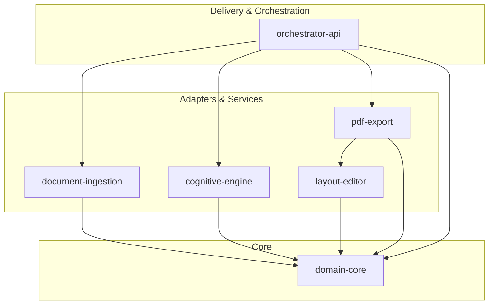

# Capability Map: One Page Generator (Co-Pilot Industrial)

> **Metodologia**: Spec-Driven Development (SDD)  
> **Status**: Aprovado para Especificação Detalhada  
> **Versão**: 1.0.0  
> **Data**: 2026-09-18  

---

## 1. Visão Geral da Decomposição do Sistema

O sistema **One Page Generator** decompõe-se em 6 módulos funcionais independentes e testáveis, organizados segundo os princípios de **Clean Architecture** e **Ports & Adapters**, com dependências estritamente unidirecionais (sem ciclos):

---

## 2. Mapa de Capacidades (Módulos)

| Module ID | Responsabilidade Principal | Depende de | Artefato de Especificação |
|---|---|---|---|
| `domain-core` | Entidades agregadoras (`OnePageReport`, `SectionContent`, `BudgetFinep`), Value Objects, Invariantes de Negócio, Cálculo de Métricas A4 e Tipagens Canônicas (Zod / Pydantic). | *Nenhuma* | [`SPEC-domain-core.md`](file:///c:/workspace/one_page_generator/docs/specs/SPEC-domain-core.md) |
| `document-ingestion` | Pipeline de extração híbrida de PDFs, cálculo do Índice de Sanidade do Texto ($TSI$), chaveamento automático PyMuPDF $\rightarrow$ OCR docTR/Marker e pré-processamento. | `domain-core` | [`SPEC-document-ingestion.md`](file:///c:/workspace/one_page_generator/docs/specs/SPEC-document-ingestion.md) |
| `cognitive-engine` | Orquestração de LLMs locais (Ollama Dev / vLLM Prod), Gap Assessment de propostas FINEP, reescrita contextual por seção, condensação sintática por taxa $CR$ e tradução técnica (PT/EN/ES). | `domain-core` | [`SPEC-cognitive-engine.md`](file:///c:/workspace/one_page_generator/docs/specs/SPEC-cognitive-engine.md) |
| `layout-editor` | Interface WYSIWYG A4 interativa, loop reativo de detecção de overflow via `ResizeObserver`, seletor de temas CSS (SENAI, SESI, FIESC, IEL), upload Base64 e persistência local debounced (IndexedDB). | `domain-core` | [`SPEC-layout-editor.md`](file:///c:/workspace/one_page_generator/docs/specs/SPEC-layout-editor.md) |
| `pdf-export` | Engine de exportação vetorial de alta fidelidade via Headless Chromium (Puppeteer), regras de CSS Paged Media (`@page`), embutimento de fontes WOFF2 e garantia de 1 página A4 sem cortes. | `domain-core`, `layout-editor` | [`SPEC-pdf-export.md`](file:///c:/workspace/one_page_generator/docs/specs/SPEC-pdf-export.md) |
| `orchestrator-api` | Controladores REST/SSE em FastAPI, injeção de dependências, orquestração de chamadas assíncronas, gerenciamento de erros globais e integração ponta a ponta. | `domain-core`, `document-ingestion`, `cognitive-engine`, `pdf-export` | [`SPEC-orchestrator-api.md`](file:///c:/workspace/one_page_generator/docs/specs/SPEC-orchestrator-api.md) |

---

## 3. Ordem de Construção (Build Order)

A implementação deve seguir estritamente a ordem de resolução de dependências para viabilizar Test-Driven Development (TDD) e isolamento:

1. **Fase 1 (Fundação)**: `domain-core`  
   *Justificativa*: Estabelece os contratos e tipos primitivos de dados consumidos por todas as camadas.
2. **Fase 2 (Serviços e Adaptadores de Extração & IA)**: `document-ingestion` e `cognitive-engine` (em paralelo)  
   *Justificativa*: Permitem o processamento e inteligência sobre arquivos reais antes de montar a UI final.
3. **Fase 3 (Renderização & Interatividade Visual)**: `layout-editor` e `pdf-export`  
   *Justificativa*: Constrói o container A4 e o motor de impressão vetorial com base no esquema validado.
4. **Fase 4 (Integração & Entrega)**: `orchestrator-api`  
   *Justificativa*: Conecta os serviços backend e frontend em um fluxo unificado e pronto para homologação.
